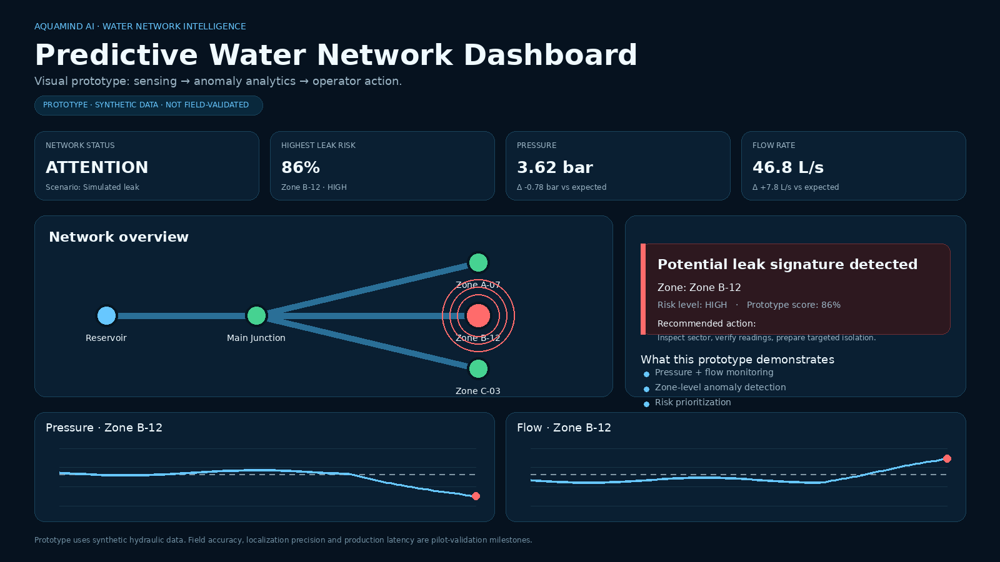

# AquaMind AI

**Predictive Water-Network Intelligence for Earlier Leak Detection and Smarter Utility Operations**

[](https://aquamindai.streamlit.app/)
[](https://github.com/xmohamedtariq/AquaMind-AI)

AquaMind AI is an AI-powered water-network intelligence prototype designed to transform pressure and flow data into earlier, clearer, and more actionable operational insights.

The platform is being developed to support water utilities in detecting abnormal hydraulic behavior, identifying potential leak-risk conditions, monitoring network zones, and helping operators respond before hidden problems become visible failures.

> **Development Stage:** Functional Prototype / Pre-Pilot  
> **Current Data:** Synthetic Hydraulic Data  
> **Next Milestone:** Validation using real utility data and a controlled field pilot

---

## Live Prototype

### Try AquaMind AI

**Live Demo:**  
[https://aquamindai.streamlit.app/](https://aquamindai.streamlit.app/)

**GitHub Repository:**  
[https://github.com/xmohamedtariq/AquaMind-AI](https://github.com/xmohamedtariq/AquaMind-AI)

The live prototype demonstrates the current AquaMind AI workflow directly in the browser.

---

## Dashboard Preview



The dashboard demonstrates how AquaMind AI can visualize hydraulic conditions, identify abnormal behavior, estimate leak-risk conditions, and support operator decisions.

---

## The Problem

Hidden water-network failures can develop long before they become visible.

Water operators may already have access to pressure and flow measurements, but transforming those measurements into early operational decisions remains challenging.

Traditional monitoring approaches can rely heavily on static thresholds, manual interpretation, or reactive alarms.

AquaMind AI is designed around a different question:

**Can hydraulic signals be transformed into predictive and actionable intelligence before a hidden network problem becomes a visible crisis?**

---

## The AquaMind AI Approach

AquaMind AI follows a simple operational workflow:

### 1. Sense

Receive hydraulic measurements from the water network, including:

- Pressure
- Flow rate
- Network zone
- Time-series measurements
- Operational conditions

### 2. Analyze

Process hydraulic behavior to identify:

- Pressure anomalies
- Unexpected flow changes
- Abnormal network patterns
- Potential leak-risk conditions
- Zone-level operational risk

### 3. Act

Translate analysis into information that can support operators, including:

- Risk indicators
- Anomaly alerts
- Affected-zone identification
- Recommended operator actions
- Prioritized network attention

---

## Current Prototype Capabilities

The current browser-based prototype demonstrates:

- Multi-zone network monitoring
- Pressure visualization
- Flow-rate visualization
- Normal operating scenarios
- Simulated leak scenarios
- Pressure-surge scenarios
- Leak-risk indicators
- Anomaly detection workflow
- Operator recommendations
- Historical hydraulic trends
- Interactive scenario controls
- Browser-based visualization

The prototype is intended to demonstrate the **end-to-end product workflow** from hydraulic signals to operational insight.

---

## Important Validation Note

The current AquaMind AI prototype uses **synthetic hydraulic data**.

It has not yet been validated on a live municipal water network.

Therefore, the current prototype should **not** be interpreted as evidence of proven field accuracy, commercial performance, or validated leak-localization performance.

The next major development milestone is real-world validation using utility data and a controlled pilot network.

---

## Technology Stack

| Layer | Technology |
|---|---|
| Programming Language | Python |
| Application Framework | Streamlit |
| Data Processing | Pandas |
| Numerical Processing | NumPy |
| Interactive Visualization | Plotly |
| Current Data Source | Synthetic Hydraulic Data |
| Deployment | Streamlit Community Cloud |
| Version Control | GitHub |

---

## System Concept

The intended AquaMind AI architecture follows this pathway:

```text
Water Network
      |
      v
Pressure + Flow Sensors
      |
      v
Data Ingestion
      |
      v
Data Processing & Normalization
      |
      v
AI / Anomaly Analysis
      |
      v
Leak-Risk & Zone Assessment
      |
      v
Operator Dashboard
      |
      v
Recommended Action
```

The long-term goal is to develop AquaMind AI as an intelligence layer that can work with existing sensing and monitoring infrastructure rather than requiring complete replacement of utility systems.

---

## Target Users

AquaMind AI is primarily designed for:

- Municipal water utilities
- Water-network operators
- Smart-city infrastructure programs
- Industrial water networks
- Water-treatment facilities
- Desalination and RO operators

The initial deployment strategy focuses on a bounded utility pilot where technical and operational value can be measured before wider deployment.

---

## Business Direction

The planned commercial model is based on a B2B / B2G approach.

A potential deployment path includes:

```text
Pilot Deployment
      |
      v
System Integration
      |
      v
Technical Validation
      |
      v
Annual Analytics / Software Subscription
      |
      v
Multi-Zone Expansion
```

The commercial model remains subject to validation through pilot deployments and customer discovery.

---

## Pilot Validation Plan

A future field pilot is intended to evaluate AquaMind AI against real operational conditions.

### Primary Validation Metrics

- Detection lead time
- False alarm rate
- Missed-event rate
- Leak localization error
- Operator response time
- Data availability
- System reliability
- Operational usefulness
- Integration complexity

The objective is not only to measure algorithm performance, but also to determine whether AquaMind AI produces information that is genuinely useful to water-network operators.

---

## Development Roadmap

### Phase 1 - Prototype & Calibration

**0-3 months**

- Refine the prototype
- Improve anomaly-analysis logic
- Prepare data-ingestion interfaces
- Test hydraulic scenarios
- Define pilot KPIs
- Prepare utility integration requirements

### Phase 2 - Field Validation

**4-8 months**

- Access real utility data
- Deploy within a bounded pilot zone
- Integrate pressure and flow measurements
- Compare system alerts with real network events
- Measure validation KPIs
- Collect operator feedback

### Phase 3 - Scale Preparation

**9-12 months**

- Improve validated models
- Expand to multiple network zones
- Strengthen monitoring and reporting
- Prepare enterprise integration
- Develop repeatable deployment procedures
- Prepare commercial software offering

---

## Repository Structure

```text
AquaMind-AI/
|
|-- app.py
|-- requirements.txt
|-- README.md
|-- .gitignore
|
|-- assets/
|   `-- dashboard-preview.png
|
`-- docs/
    |-- technical-brief.pdf
    `-- poster.pdf
```

---

## Documentation

### Technical & Prototype Brief

A more detailed description of the system architecture, implementation status, pilot strategy, technical considerations, and validation roadmap is available here:

[View AquaMind AI Technical & Prototype Brief](docs/technical-brief.pdf)

### AquaMind AI Poster

A concise visual overview of the project is available here:

[View AquaMind AI Poster](docs/poster.pdf)

---

## Current Development Status

| Area | Status |
|---|---|
| Product Concept | Completed |
| Technical Architecture | Defined |
| Browser Dashboard | Functional |
| Synthetic Data Demonstration | Functional |
| Interactive Scenario Simulation | Functional |
| Public Streamlit Deployment | Live |
| GitHub Repository | Live |
| Real Utility Data Integration | Next Phase |
| Field Validation | Not Yet Completed |
| Commercial Deployment | Future Phase |

---

## What AquaMind AI Still Needs to Prove

The next stage of AquaMind AI development must establish evidence around:

- Performance with real utility data
- Field anomaly-detection reliability
- False-positive performance
- Detection lead time
- Leak localization performance
- Operator usefulness
- Integration requirements
- Customer willingness to pay
- Deployment economics
- Scalability across multiple network zones

These are intentionally treated as validation objectives rather than existing proven results.

---

## Project Vision

AquaMind AI aims to help water systems move from:

**Reactive monitoring**

to

**Predictive operational intelligence**

The long-term vision is to help water utilities detect hidden network problems earlier, prioritize intervention more effectively, and make better use of existing hydraulic data.

> **Turn hidden water-network problems into earlier, clearer, and more actionable operational decisions.**

---

## Founder

**Mohammed Tariq Al-Saqqaf**  
Founder & Lead Innovator  
Mechatronics Engineer

Areas of focus:

- Artificial Intelligence
- Mechatronics
- IoT sensing
- Control systems
- Water-network intelligence
- Product prototyping

---

## Project Links

**Live Prototype**  
[https://aquamindai.streamlit.app/](https://aquamindai.streamlit.app/)

**GitHub Repository**  
[https://github.com/xmohamedtariq/AquaMind-AI](https://github.com/xmohamedtariq/AquaMind-AI)

---

## Project Status

**AquaMind AI is currently a functional pre-pilot prototype.**

The project is actively progressing toward real-world utility validation, technical benchmarking, and pilot deployment.

---

**AquaMind AI - Predictive Water-Network Intelligence**
